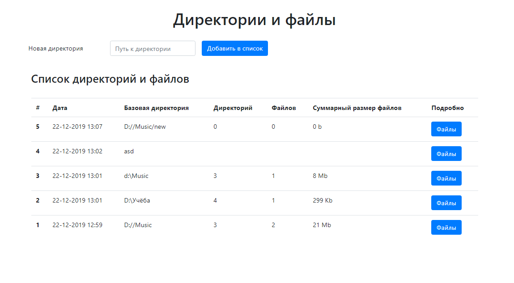
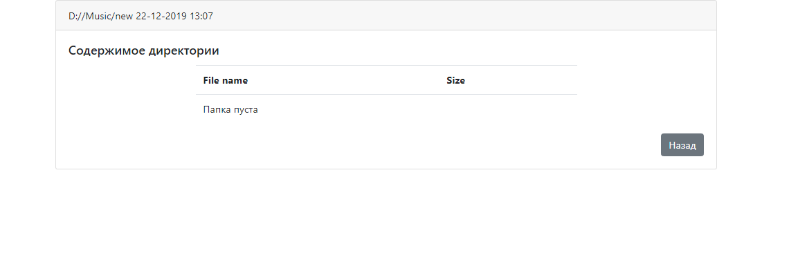

# Spring Boot web service
(Boot + MVC + Data + MySQL + Thymeleaf + Bootstrap + JUnit)

Программа представляет собой веб-приложение по работе с реальной файловой системой. В текстовое поле вносится путь к директории на ПК
и после нажатия на кнопку **"Добавить в список"** делается снепшот директории. На серверной стороне в базе данных сохраняется некоторая информация об этой директории:
+ Дата 
+ Путь
+ Количество вложенных поддиректорий
+ Количество вложенных файлов
+ Общий размер файлов.
 

После сохранения в базу данных запрос отображается на клиентской части в таблице. При нажатии на кнопку **"Файлы"** отображается содержимое соответствующей папки и размер каждого файла. Данные в папке отсортированы по алгоритму: 

+ сначала поддиректории, затем файлы 
+ сортировка по алфавиту без учета регистра
  + в случае включения в имя числовых групп дополнительно сортировать имена по возрастанию чисел

## Запуск приложения
1. Git [clone](https://github.com/Laboulaye/dirs-files-web-service.git)
2. Создать базу данных *directory_files*
3. В файле *application.resources* изменить данные *username/password* на свои

## Работа приложения
Приложение обращается к файловой системе ПК и записывает в базу данных содержимое переданной директории. Если передан ошибочный адрес, приложение все равно записывает этот запрос в базу, но при попытке посмотреть содержимое укажет на несоответствие.
 
Содержимое директории определенного запроса можно посмотреть, передав адрес запроса в url строки браузера. *http://localhost:8080/files/{idЗапроса}*. При попытке обратиться к несуществующему запросу приложение укажет на несоответствие.

 

 

 

 

 

